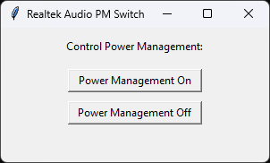

# Realtek Audio PM Switch


A simple GUI application to **fix the Realtek audio popping issue** by toggling power management settings for Realtek audio devices on Windows.*
  
  *Hopefully this workaround fixes your Realtek audio device until they fix it in the driver.



## Description

This application allows users to enable or disable power management for Realtek audio devices by modifying the Windows registry.

## Version

Current pre-release version: **v0.1.0**

## Requirements

- Python 3.6 or higher
- `tkinter` (usually included with Python)
- `pywin32` library

## Installation

1. **Clone the repository:**

   ```sh
   git clone https://github.com/ConceptExplorer/Realtek-Audio-PM-Switch.git
   cd Realtek-Audio-PM-Switch

Requirements:
Install the pywin32 library:
pip install pywin32

Usage
Run the script with administrative privileges:
python realtek_audio_pm_switch.py

License
This project is licensed under the MIT License.
